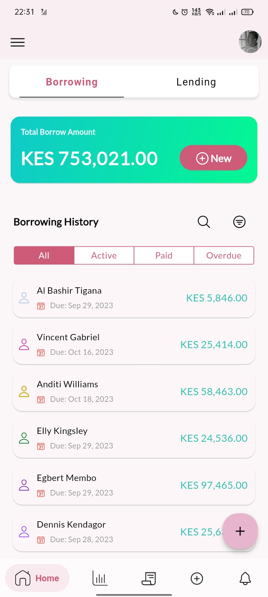
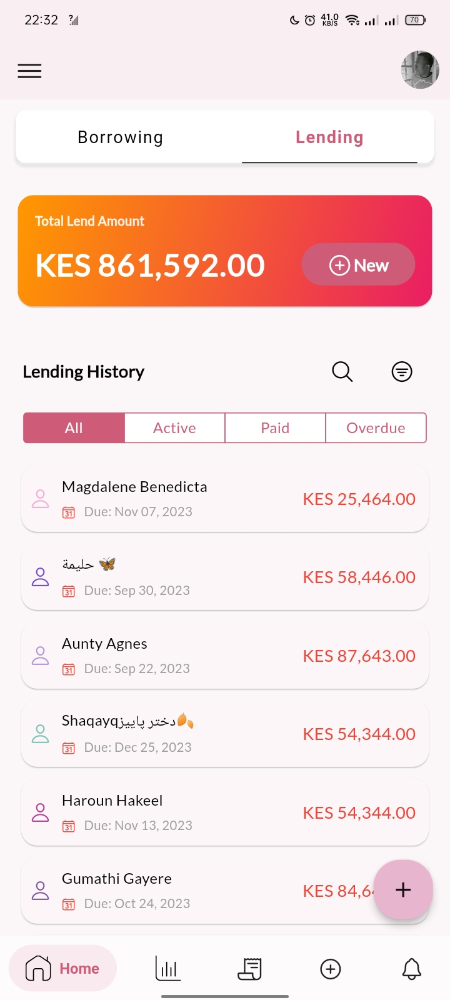

# Loan Tracker App

The Loan Tracker app is a simple mobile application that allows users to keep track of their loans and debts. Users can easily record information about their borrowers or creditors, such as the loan amount, due date, and a brief description. The app provides a convenient way to manage and organize loan-related data.

  
  

## Features

- **Add New Loan**: Users can add new loans or debts with details like borrower's/creditor's name, loan type (lend or borrow), loan amount, due date, and a brief description.

- **Select Loan Date**: Users can select the date of the loan, which helps in organizing and categorizing their loans effectively.

- **Select Due Date**: Users can set a due date for each loan, making it easier to keep track of upcoming payment deadlines.

- **Attach Profile Picture**: Users can attach a profile picture for each borrower or creditor, providing a visual reference to the person associated with the loan.

- **Loan Type**: The app allows users to specify whether they are lending or borrowing money, making it easy to differentiate between different types of transactions.

- **Image Picker**: The app provides an image picker that allows users to select a profile picture from their device's gallery.

- **Save Data**: The app saves the user's loan data, even after closing the app, ensuring that users can access their loan history anytime.

- **Error Handling**: The app includes input validation and error handling to ensure that users enter valid and necessary information.

## Screenshots

## Installation

1. Make sure you have Flutter installed on your system. If not, follow the instructions [here](https://flutter.dev/docs/get-started/install) to set up Flutter.

2. Clone this repository to your local machine using:
